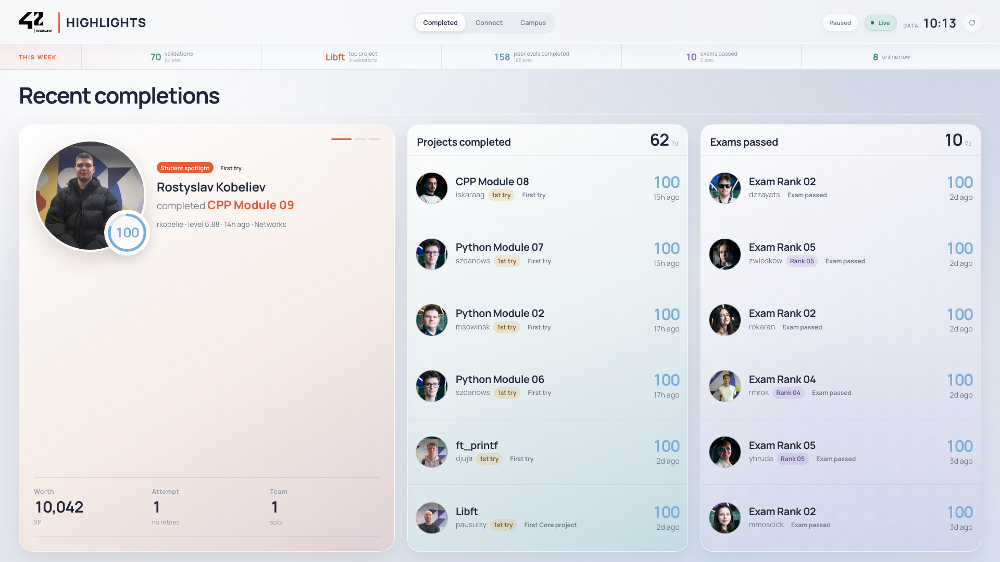
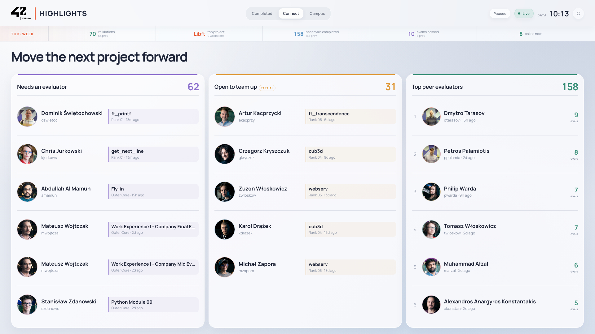
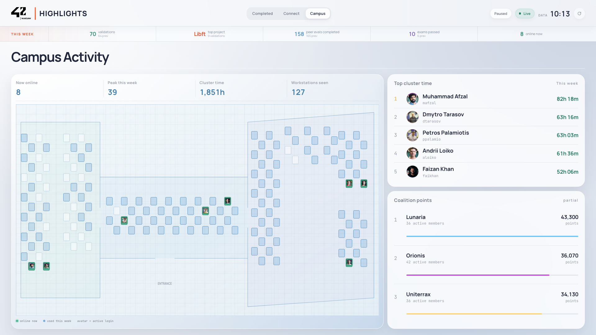

# 42 HIGHLIGHTS

TV dashboard for the 42 Warsaw Social Space, built for 42 Warsaw Hacks 2026. It uses the live 42 API to show recent Common Core progress, people looking for help, and campus activity.

**Docs:** [API data usage](docs/01-API.md) | [Architecture & deployment](docs/02-ARCHITECTURE.md)







## Run

Requires Node.js 22 and credentials from a 42 API application.

```bash
npm ci
cp .env.example .env
# Add FT_CLIENT_ID and FT_CLIENT_SECRET to .env
npm run dev
```

Open `http://localhost:4242`.

## What works

- The server gets real data from ten 42 API addresses. It reads every page, slows down when needed, and retries short failures.
- The screen shows weekly numbers, including `validations this week`, completed peer evaluations, passed exams, and people logged in now.
- If the API stops working, the app keeps showing the last working data instead of a blank screen.
- The app runs on a computer or in Docker. It includes URLs for checking its status and starting an update.

## Display

The public one-minute loop has three scenes:

- **Completed, 24 s:** recent project and exam passes
- **Connect, 18 s:** evaluation requests, team search, and weekly peer evaluators
- **Campus, 18 s:** active workstations, weekly cluster time, and coalition context

The dashboard switches scenes automatically on a continuous 60-second schedule designed for unattended TV displays. Current 1920 x 1080 screenshots are in [`docs/img`](docs/img).

## Data handling

A card with a name or picture appears only for an active Warsaw Common Core student. The app hides workstation pins and evaluator requests when required data is missing. It never replaces missing data with invented demo data.

## Checks

```bash
npm test
npm run typecheck
npm run build
npm run start
npm run smoke
```

## Still to verify

- Run the dashboard on the actual Social Space MagicInfo screen and check the 1920 x 1080 layout and automatic scene transitions.
- Review the UI on that screen and adjust text sizes, spacing, colours, and scene layouts if needed. The final view should be easy to read and match the 42 Warsaw style.
